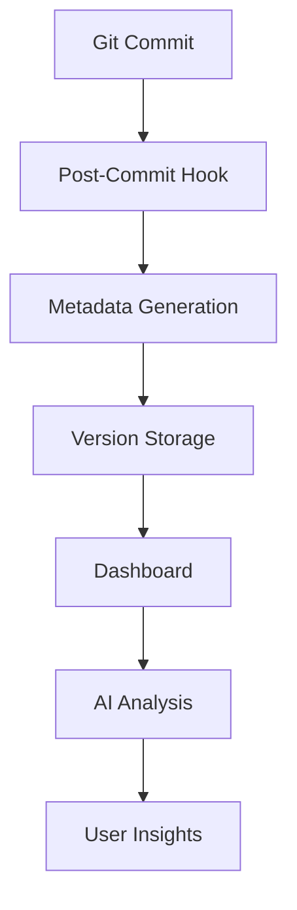
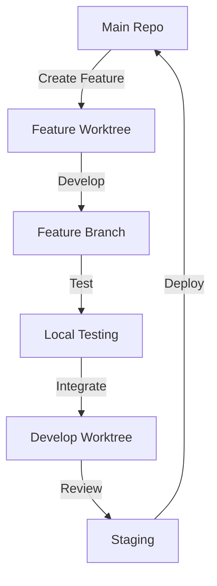

# BauDevs Monorepo


[](./LICENSE)
[](./libs/bauLogHero/LICENSE)
[](./libs/bau-gtm-tracker/LICENSE)
[](https://nx.dev)


A modern, intelligent monorepo setup powered by Nx, featuring an advanced analytics
dashboard for real-time repository insights and sophisticated Git worktrees workflow.

## Overview

This monorepo combines the power of Nx for project management with custom-built
analytics tools to provide deep insights into your development workflow. It includes:

* Advanced Git worktrees workflow for parallel development
* Automated metadata generation for repository insights
* Real-time dashboard for visualizing repository health
* AI-powered change analysis between versions
* Smart project dependency management
* Automated version tracking and history

## Features

### Git Worktrees Management

We use a sophisticated Git worktrees setup that enables:

* Parallel development of multiple features
* Isolated workspaces for each library/app
* Clean separation of staging and production code
* Efficient branch management and integration

#### Repository Structure

```bash
baudevs-monorepo/              # Main repository (staging & main branches)
├── apps/
├── libs/
└── ...

baudevs-monorepo.worktrees/    # Worktrees directory
├── develop/                   # Development integration worktree
├── bau-cms-core/             # Feature worktree for CMS core
├── bau-cms-database/         # Feature worktree for database
└── ...                       # Other feature worktrees
```

### Analytics Dashboard

The dashboard (`apps/baudevs-dashboard`) provides real-time insights into your monorepo:

#### Version Comparison

* Project changes (added, removed, modified)
* Dependency changes
* Statistical trends
* AI-generated summaries of changes
* Git activity analysis

#### Repository Health

* Project dependency graphs
* Contribution statistics
* Build performance metrics
* Project categorization

### Automated Metadata Generation

The repository includes a sophisticated metadata generation system that:

* Tracks repository changes in real-time
* Generates detailed project statistics
* Analyzes git worktrees and branch relationships
* Maintains a versioned history of repository state

## Technical Architecture

### Core Components

1. **Metadata Generation** (`scripts/generate-repo-metadata.ts`):
    * Collects repository statistics
    * Analyzes project relationships
    * Tracks git activity
    * Generates versioned metadata

2. **Git Hooks** (`scripts/hooks/`):
    * Post-commit hook for automatic metadata updates
    * Smart detection of relevant changes
    * Efficient metadata generation and storage

3. **Dashboard Application** (`apps/baudevs-dashboard/`):
    * Next.js-based web interface
    * Real-time data visualization
    * AI-powered change analysis
    * Interactive version comparison

### Data Flow



### Git Workflow

#### Main Repository

The root repository (`baudevs-monorepo/`):

* Houses the `main` branch (production)
* Contains the `staging` branch (pre-production)
* Manages releases and deployments

#### Feature Worktrees

The worktrees directory (`baudevs-monorepo.worktrees/`):

* Isolated development environments
* Feature-specific branches
* Independent build and test capabilities

#### Development Flow



## Setup Guide

### Prerequisites

* Node.js (via nvm)
* Bun package manager
* Git

### Installation

1. Clone the repository:

    ```bash
    git clone https://github.com/baudevs/baudevs-monorepo.git
    cd baudevs-monorepo
    ```

2. Install dependencies:

    ```bash
    bun install
    ```

3. Set up git hooks:

    ```bash
    bun run prepare
    ```

4. Configure environment variables:

    ```bash
    cp apps/baudevs-dashboard/.env.example apps/baudevs-dashboard/.env
    # Add your OpenAI API key for AI-powered insights
    ```

5. Start the dashboard:

    ```bash
    bun nx serve baudevs-dashboard
    ```

### Worktrees Setup

1. Create the worktrees directory:

    ```bash
    mkdir -p ../baudevs-monorepo.worktrees
    ```

2. Set up the develop worktree:

    ```bash
    git worktree add ../baudevs-monorepo.worktrees/develop develop
    ```

3. Create feature worktrees:

    ```bash
    # From develop worktree
    cd ../baudevs-monorepo.worktrees/develop
    git checkout develop
    
    # Create feature branch and worktree
    git branch feature/new-library
    git worktree add ../baudevs-monorepo.worktrees/new-library feature/new-library
    ```

### Development Workflow

1. **Starting New Features**:

    ```bash
    # Create new feature worktree
    git worktree add ../baudevs-monorepo.worktrees/my-feature develop
    cd ../baudevs-monorepo.worktrees/my-feature
    git checkout -b feature/my-feature
    ```

2. **Working on Features**:
    * Make changes in your feature worktree
    * Commit and push to your feature branch
    * Run tests and builds locally

3. **Integration**:

    ```bash
    # In develop worktree
    cd ../baudevs-monorepo.worktrees/develop
    git merge feature/my-feature
    
    # Test integration
    nx affected:test
    nx affected:build
    ```

4. **Cleanup**:

    ```bash
    # After feature is merged
    git worktree remove ../baudevs-monorepo.worktrees/my-feature
    git branch -d feature/my-feature
    ```

5. **Metadata and Analytics**:
    * Each commit triggers metadata generation
    * Dashboard updates automatically
    * AI analysis available for version comparisons

## Making it Your Own

### For Development Teams

1. **Fork and Customize**:
    * Fork the repository
    * Update project types and categories
    * Customize metadata collection
    * Modify AI prompts for your domain

2. **Integration Options**:
    * GitHub Actions support
    * CI/CD pipeline integration
    * Custom metric collection
    * Team-specific analytics

### For Open Source

1. **Core Features to Expose**:
    * Metadata generation system
    * Dashboard components
    * AI integration
    * Version comparison logic

2. **Extension Points**:
    * Custom metadata collectors
    * Visualization plugins
    * Analysis providers
    * Theme customization

## Contributing

We welcome contributions! Here's how you can help:

### Code Contributions

* Fork the repository
* Create a feature branch
* Submit a pull request

### Documentation

* Improve this README
* Add code comments
* Create usage examples

### Feature Requests

* Open issues for new features
* Provide use cases
* Share your ideas

## Best Practices

### Worktrees Management

1. **Branch Organization**:
    * Keep `main` and `staging` in the root repository
    * Use feature branches in worktrees
    * Name worktrees meaningfully

2. **Integration Strategy**:
    * Regularly merge `develop` into feature branches
    * Test integration in the develop worktree
    * Use the dashboard to monitor changes

3. **Cleanup**:
    * Remove worktrees after feature completion
    * Keep the worktrees directory organized
    * Regularly update all worktrees

## License

This project is available under a dual license model:

### Non-Commercial License

* Free for personal use, non-profit organizations, and companies with annual revenue
  under $1M USD
* Includes rights to use, modify, and distribute the software
* Requires attribution to BauDevs
* Modifications must be shared under the same license terms
* Source code must remain open source

### Commercial License

Required for:

* Companies with annual revenue over $1M USD
* Commercial use in enterprise environments
* Proprietary modifications or integrations
* Custom support and implementation assistance

To obtain a commercial license, please contact:

* Email: <license@baudevs.com>
* Subject: Commercial License Request
* Include your company details and intended use case

### License Comparison

| Feature                    | Non-Commercial | Commercial |
|---------------------------|----------------|------------|
| Use in personal projects  | ✓             | ✓         |
| Use in non-profit org     | ✓             | ✓         |
| Use in small business     | ✓             | ✓         |
| Use in enterprise         | ✗             | ✓         |
| Modify source code        | ✓             | ✓         |
| Keep modifications private | ✗             | ✓         |
| Technical support         | Community      | Priority   |
| Custom implementation     | ✗             | Available  |
| Remove attribution        | ✗             | Optional   |

For any licensing questions or clarifications, please contact <license@baudevs.com>

## Acknowledgments

* Built with [Nx](https://nx.dev)
* Powered by [Next.js](https://nextjs.org)
* AI features by [OpenAI](https://openai.com)
* Visualization with [Recharts](https://recharts.org)

## Support

* GitHub Issues: [Report a bug](https://github.com/baudevs/baudevs-monorepo/issues)
* Email: <contact@baudevs.com>
* Website: [baudevs.com](https://baudevs.com)

---

Built with ❤️ by BauDevs Team

## Release Process

Our monorepo features an intelligent release process that combines Nx's powerful versioning capabilities with OpenAI's analysis for automated version determination.

### Local Development Steps

1. **Prepare Your Environment**

   ```bash
   # Ensure you're on the main branch and up-to-date
   git checkout main
   git pull origin main

   # Create a release branch
   git checkout -b release/@baudevs/your-project-name
   ```

2. **Make Your Changes**

   ```bash
   # Make changes to your project
   # Stage and commit using conventional commits
   git add .
   git commit -m "feat(your-project): add new feature"
   ```

3. **Push to Remote**

   ```bash
   git push -u origin release/@baudevs/your-project-name
   ```

### Automated Release Process

The push to a `release/@baudevs/*` branch triggers our automated release workflow:

1. **AI Analysis Phase**
   * OpenAI analyzes the git diff
   * Determines appropriate version bump (patch/minor/major)
   * Considers:
     * Breaking changes (API modifications, removals)
     * New features (backward compatible additions)
     * Bug fixes and internal changes
   * Can request human review if unsure

2. **Human Review (if needed)**
   * Creates a GitHub issue for review
   * Requires approval from team members
   * Allows selection of version type
   * Provides AI reasoning for reference

3. **Version Plan Creation**

   ```bash
   # Automatically executed by CI
   pnpm nx release plan [version-type] \
     --projects=@baudevs/your-project \
     --only-touched=false
   ```

4. **Release Execution**
   * Builds and tests the project
   * Creates GitHub release
   * Publishes to npm
   * Updates CDN links

### Version Types

* **major** (1.0.0 → 2.0.0)
  * Breaking changes
  * API modifications
  * Major dependency updates

* **minor** (1.0.0 → 1.1.0)
  * New features
  * Backward compatible changes
  * Non-breaking updates

* **patch** (1.0.0 → 1.0.1)
  * Bug fixes
  * Documentation updates
  * Internal refactoring

### Example Version Plan

```markdown
# Version Plan for @baudevs/your-project

## Changes Analysis
[AI-generated analysis including:
- Technical impact assessment
- Performance implications
- Breaking changes identification
- Security considerations
- Dependency analysis]

## Release Type
minor

## Project
"@baudevs/your-project"
```

### Important Notes

1. **Branch Naming Convention**
   * Must follow: `release/@baudevs/[project-name]`
   * Example: `release/@baudevs/bau-gtm-tracker`

2. **Required Secrets**

   ```bash
   OPENAI_API_KEY=sk-xxx    # For AI analysis
   NPM_TOKEN=npm_xxx        # For publishing
   GITHUB_TOKEN=ghp_xxx     # For releases
   NX_TOKEN=nx_xxx          # For Nx Cloud
   ```

3. **Workflow Files**
   * `.github/workflows/release.yml`: Main release workflow
   * `.github/workflows/release-with-plan.yml`: Reusable release workflow

4. **Version Plan Location**
   * `.nx/version-plans/version-plan-[timestamp].md`

5. **Security Considerations**
   * AI analysis includes security impact
   * Automated vulnerability checks
   * Secure publishing process

### Troubleshooting

1. **Version Plan Not Generated**
   * Check branch naming
   * Verify OpenAI API key
   * Review git diff output

2. **Release Failed**
   * Check npm authentication
   * Verify version plan format
   * Review build logs

3. **Human Review Needed**
   * Check GitHub issues
   * Review AI reasoning
   * Select appropriate version
